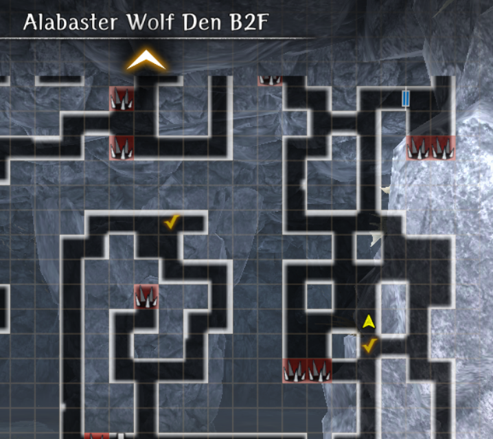

# Alabaster Hunting

!!! warning "Work in Progress"
    - Ctrl + F5 to refresh the page for new updates

## Unlock Condition 

- Step foot into Route 1 of Abyss 4, Deepsnow Hinterlands of Isberg. 

## Overview 

??? note "How to Accept the Request" 
    - Go to the Royal Capital Guild. Under Requests - Featured select "Bring Me an Alabaster Pelt."
    - Speak with Lady Matilda and read each of the options. If you have a Ranger in your party, you will receive slightly different text

??? warning "Important Notes - Read Me"

    === "Before You Begin" 

        - Endings
            - There are a total of 4 different endings. A minimum of 3 runs are required to complete the request. 
            - The 1st and 2nd run end in failure, but provide Knowledge that is mandatory for both the "Good" and "Best" endings. 
        - Ranger
            - Units: Yrsa (Limited Legendary) and Heinrico (General).  
            - The first 2 runs and the "Good" ending can be completed without a Ranger in your party. 
            - A L25 Ranger is required for the "Best" ending to set a required bear trap. 
            - Provide additional commentary throughout the dungeon and will point out the correct path to take on each floor. 
        - Farming
            - Alabaster is one of the best farming locations in the game. It provides access to Hunting Gloves and Boots (current best-in-slot) as well as Steel 5* Red junk that is on par with well-rolled Silver gear. 
            - Enemies on B1F are fairly weak so it is new player friendly if you have not yet passed the Copper exam. 
            - Currency amounts from map or enemy chests are fairly low at 20-60.  
            - Tends to have a higher-than-average relic monster spawn rate. Notable enemies include Scorpion Lady, Vorpal Bunny, (Snow) Big Slime, and Frost Plant.  

    === "How to Reset" 

        - Go to the Ruins - Cursed Wheel. In the bottom right-hand corner is the Special Request button. 
        - Select Alabaster Hunting and Leap.

    === "Troubleshooting"
    
        - The request has been plagued with bugs and broken flags since it first launched and has required several patches. 
        - If you are running into issues you can post in the comments below or ping @seventhus or @lightbearer on the [Discord](https://discord.gg/CKrdEgzAz).  

??? warning "Request Reward" 

    

    
    

    - Fixed at 3* Blue. Note that bows are the only weapons that can roll ASPD blessings. 
    - Comes with Passive SP Up that gives a flat 6 SP that does not increase upon enhancement.

##### Alabaster Wolf Den 

??? note "Dungeon Notes"

    === "Basics" 
    
        - The dungeon has 3 floors with multiple long, branching paths with spike traps scattered throughout. On both B1F and B2F there are 2 drop-down holes that take you to self-contained side areas.  
        - If you have a Ranger in your party they will stop and tell you the correct path to take if you are doing a blind run. 
        - Large variety of enemies, but primarily Magical Beasts and Demi-Humans. Gorgons will begin appearing as regular encounters on B3F. 
        - Encounters can include up to 3-4 rows of enemies. It is helpful if you have AOE row attacks (MA- spells, Wide Volley, Unending, MoF, etc.) or use Katino (Sleep) or Kantios (Confuse) for crowd control. 
        - Not a good location for farming EXP. 
        - Enemy level is 66-68 at Copper Grade. 

    === "Enemies" 

        - Demi-Human
            - Snowland Hobgoblin
            - Snowland Goblin, Archer, Mage, and Cleric 
        - Magical Beast
            - Vorpal Bunny 
            - Scorpion Lady
            - Gorgon (B2F and B3F only) 
        - Magical Beings
            - Snow Slime
            - Snow Big Slime
        - Insect
            - Abyssal Insect
            - Dragon Fly 
        - Other
            - Frost Plant (Plant)
            - Pixie (Fairy)
            - Succubus (Demon)

??? map "B1F"
    

??? map "B2F"
    

??? map "B3F"
    

## Guide

??? note "1st Run - Bad Ending 1"

    === "Guide" 
    
        - Accept the request at the Royal Capital Guild. Go to the world map and head to the Alabaster Wolf Den.
        - B1F
            - Head to the SE stairs. The sidepaths will take you to an optional fight against a normal wolf. If you have a Ranger in your party they will tell you to ignore it and point out the correct path to follow. 
            - There are 2 drop-down holes that will take you to a self-contained side area.
        - B2F
            - Ignore the first set of stairs. It takes you to a small side area if you fall into either drop-down hole. Progress until you encounter a Gorgon and Lulu will comment.
            - If you have a Ranger, you can set a trap. If you opt to fight (2 Gorgons front row, 2 Pixies backrow), then use Kantios (Confuse) to prevent the Gorgons from using their stone breath attack.
            - At the end of the path you will encounter a wolf. It has infinite HP and will flee after you do enough damage. Continue north to the B3F stairs. 
        - B3F
            - Upon entering you will find a dead body. Collect the body and exit via the B2F Harken. Go to the Temple and speak with the revived hunter. If you do not speak with him, then the wolf boss will not spawn on B3F.
            - Harken to B2F, go north to B3F, and proceed to the bottom-left room. 
            - Note that there are more difficult enemies on this floor, including Gorgons.
            - Defeat the Alabaster Balewolf. 
        - Post-Battle 
            - After the fight a second wolf will appear and both will escape. You will gain the "There Are Two Alabaster Balewolves" Knowledge. 
            - The request automatically fails. Return to the Guild and submit the failed request. Reset the request using the Cursed Wheel ("Special Requests") to start the 2nd run. 

    === "Boss: Alabaster Balewolf"
    
        - You will encounter the wolf again, but this time it self-buffs with 4 turns of ATK and ASPD. It can take 2 actions per turn and will auto-attack when taking physical damage.
        - It has ~10K HP. A basic strategy is to defend with your front row to proc openings while the backrow does DPS and provides support. If you are taking too much damage, then use Knight's Defense and Makalatu as an extra layer of protection.

??? note "2nd Run - Bad Ending 2"

    === "Guide" 
    
        - B1-2F 
            - Repeat the steps from the 1st Run, but when you encounter the wolf on B2F you will be given a new option to ignore it for now. 
            - It is important that you do not aggro the wolf as you move north; track its location on the mini-map. 
        - B3F
            - Ignore the dead hunter. He does not need to be revived on this run. 
            - Go to the bottom-left room again and prepare for a fight against both wolves at the same time. 
        - Post-Battle 
            - After defeating the pair you will receive the Damaged Alabaster Pelt as well as the "Alabaster Balewolf Intervention" Knowledge. 
            - Optional: Return to the Guild and submit the request but it will automatically fail again. 
    - The goal for the 3rd and 4th run is to distract or trap, respectively, the wolf on B2F so that it does not intervene in your fight against the second wolf on B3F. Used the Cursed Wheel to reset the request again. 

                !!! warning "Diverging Endings"
                    - If you do not have a Ranger in your party, you will automatically be routed to the 3rd Run ("Good Ending"). This ending has a more difficult boss fight.  
                    - A Ranger (Level 25 or higher) is required for the 4th Run ("Best Ending"). 
                    - They both lead to the same outcome and reward, but if you want all of the compendium entries then you will need to do both. 

    === "Boss: 2x Alabaster Balewolfs
        - The fight is structured similarly except now they receive an additional ACC buff.
        - More fight details forthcoming. 

??? note "3rd Run - Good Ending"

    === "Guide" 

        - B1F and B2F
            - Same steps as the 2nd Run. Ignore the wolf on B2F.  
        - B3F 
            - Collect the body of the dead hunter, exit, and revive him at any Temple. This step is mandatory.  
            - Warning! Remove any Rangers in your active party before visiting the Temple. If they are present then you will be routed to the 4th Run ("Best" Ending). 
            - Revive the dead hunter. When you speak with him there will be a new option (second choice) that you want to "pin down" the Alabaster wolf. Pay the 1,000 gold to receive the Game Hunter's Rabbit Meat.  
        - B2F
            - Harken back to B2F.
            - Important! Review the "Map - Bait Placement" tab. Go to the check-marked tile. If done correctly a cutscene with Lulu will play. If you move outside the wolf's patrol area, then the game may become bugged and you will have to exit and try again or reset the entire request. 
            - With the wolf distracted head to B3F. 
        - B3F
            - Return to the bottom-left room and engage the wolf. 
        - Boss: 2x Alabaster Balewolfs 
            - Warning! Unlike the 2nd run where you fought the wolves together you will have back-to-back fights against each one. You will have no opportunity to heal, restore MP/SP, or cleanse status ailments between fights. 
            - Note that the B2F wolf (second fight) has permanent buffs that cannot be removed and can attack after every turn. 
        - After the fight you will receive the Alabaster Pelt. Return to the Guild and submit the request. You will receive a gold reward and a Verdant Frost Branch Bow. 
        - The request is successfully completed. Doing the 4th Run ("Best" ending) is completely optional unless you want all the compendium entries. 

    === "Map - Bait Placement"
    
        

??? note "4th Run - Best Ending - Requires Ranger L25" 
   
    - B1F and B2F
        - Same steps as the 2nd Run. Ignore the wolf on B2F.  
    - B3F 
        - Collect the body of the dead hunter, exit, and revive him at any Temple. This step is mandatory.  
        - Warning! A Ranger (L25 minimum to set traps) must be in your active party before visiting the Temple. If they are not present then you will be routed to the 3rd Run ("Good" Ending). They are also required for the entire remainder of this run.  
        - Revive the dead hunter. When you speak with him there will be a new option (second choice) that you want to "pin down" the Alabaster wolf. Since you have a Ranger in your party, he will tell you to use a bear trap to immobilize the B2F wolf. 
    - B2F
        - Harken back to B2F.
        - Set a bear trap anywhere in the wolf's patrol area. To avoid potential bugs do not move too far north or south outside of its patrol area.
        - When you set the trap do not move or enter any inputs until you get a short cutscene with Lulu. If the cutscene fails to play, the immediately exit and re-enter, and try again. 
        - Bug! It is possible to do all the steps correctly and not get the Lulu scene. As long as the B2F wolf is patrolling you can reset by going to an Inn. This will restock your traps and potentially fix any broken flags. You can also try exiting the game and reloading. 
    - B3F
        - Return to the bottom-left room and engage the wolf. 
    - Boss: Alabaster Balewolf
        - The fight is similar to its past versions. 
        - After the fight select the option to "Let it go". 
    - Final Steps
        - Return to B2F and head to the area where the wolf was patrolling. Walk around until you trigger a cutscene where your Ranger will release the wolf from the trap. 
        - Head to the B2F Harken. Both wolfs will reappear and lead you to the buried location of the Alabaster Coat. Using your reversal powers to restore it to pristine condition. 
        - Return to the Guild and submit the request. You will receive a gold reward and a Verdant Frost Branch Bow.  
        - The request is successfully completed. Doing the 3rd Run ("Good" ending) is completely optional unless you want all the compendium entries.
